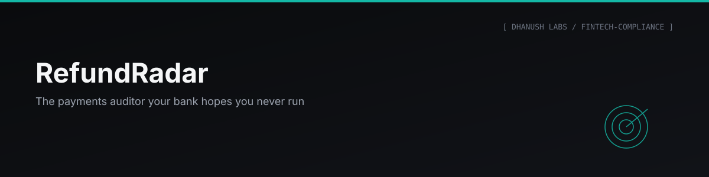

<p align="center"></p>


### The Payments Auditor Your Bank Hopes You Never Run

**[▶ Try the live demo →](https://dhanu2626.github.io/refundradar/)** — a real audit of a synthetic statement. No install, no signup. The demo page cannot receive a file.

---

## Problem Statement

> [!IMPORTANT]
> When a digital payment fails in India — money debited, credit never arrives — [RBI circular RBI/2019-20/67](https://www.rbi.org.in/Scripts/NotificationUser.aspx?Id=11693) requires your bank to auto-reverse it within a fixed deadline and pay you ₹100 per day of delay, *suo moto*, without you complaining. In practice, almost nobody checks whether the bank complied. RefundRadar checks.

## Architecture

```
STATEMENT (.xlsx/.csv) ──parse──► RECONCILE debit ↔ reversal
                                        │
                                        ▼
                          APPLY RBI/2019-20/67 AS CODE
                                        │
                                        ▼
                       COMPLAINT PACK (letter + timeline + Ombudsman draft)
```

Everything runs locally — no server, no upload, statements never leave your machine.

## How It Works

```bash
python -m venv .venv
.venv\Scripts\python -m pip install -r requirements.txt
.venv\Scripts\python -m refundradar serve
```

Open `http://127.0.0.1:8626` → "Try with a demo statement." Or via CLI: `python -m refundradar audit mystatement.xlsx` (`--password` for SBI-locked files).

## Features

- **Parses real bank exports** — Excel/CSV, including SBI's password-protected files.
- **Reconciles every failed debit against its reversal** — flags late or missing refunds, ignores genuine merchant refunds.
- **Applies the circular as code** — computes exactly what's owed, clause by clause.
- **Generates the complaint pack** — grievance letter with evidence table, 30-day escalation timeline, pre-filled RBI Ombudsman draft.
- **Privacy by construction** — no name, DOB, phone, or login ever requested; `.gitignore` refuses real statement files by design.

## Screenshots

> [!NOTE]
> Add captures of the demo audit flow and a sample complaint pack output here.

## Interactive Demo

**[dhanu2626.github.io/refundradar](https://dhanu2626.github.io/refundradar/)** — runs entirely against a synthetic statement; there is no upload endpoint on the demo build, so no file you provide can leave your browser.

## Engineering Decisions

Every judgment call is written down with reasoning and residual risk in `rules/DECISIONS.md`:

| Decision | Reasoning |
|---|---|
| Deadlines counted in calendar days | The circular defines T as a calendar date |
| NEFT excluded | Falls under a different regime (penal interest at repo + 2%) |
| Ambiguous UPI defaults to the longer deadline | Keeps the claim undisputable |
| Inferred reversals never auto-claimed | User confirms first, even when detectable from amount/timing |

> [!WARNING]
> This is a self-help tool applying published RBI circulars to your own statement. It is **not legal advice** — verify every figure before submitting a complaint.

## Project Structure

```
refundradar/
├── refundradar/           parsing, reconciliation, RBI rule engine, complaint generator
├── rules/DECISIONS.md     every judgment call, written down
├── tests/                 69 tests incl. planted-ground-truth reconciliation exam
└── CONTRIBUTING.md        how to add a bank parser
```

## Tech Stack

Python · pandas (statement parsing) · pytest

## Results

| Statement format | Status |
|---|---|
| SBI Excel/CSV (incl. password-protected) | ✅ field-tested on a real statement |
| Generic CSV | ✅ |
| Other banks | 🚧 in progress |
| PDF statements | 🚧 planned |

69 tests passing, including a planted-ground-truth exam the reconciler must pass (find every failure, fall for no traps), plus a live field test on a real SBI statement.

## Future Improvements

More bank formats, PDF statement parsing, per-bank grievance-cell addresses (v1.0 roadmap in `PROJECT.md`), and the RBI Account Aggregator consent-based "connect your bank" flow documented as the v2 ambition in `UX-SPEC.md`.

## Lessons Learned

Data minimization turned out to be a product strategy, not just a constraint — an app that never asks for identity data can't leak it. The canonical schema was built so an Account Aggregator feed would plug in as just another parser, not a rewrite.

## License

MIT © 2026 Dhanush Jangadi

## Contact

Dhanush Jangadi — [GitHub](https://github.com/Dhanu2626) · [LinkedIn](https://www.linkedin.com/in/jangadidhanush)

---
<p align="center"><sub>Part of the <b>Dhanush Labs</b> portfolio · engineered by <a href="https://github.com/Dhanu2626">Dhanush Jangadi</a></sub></p>
