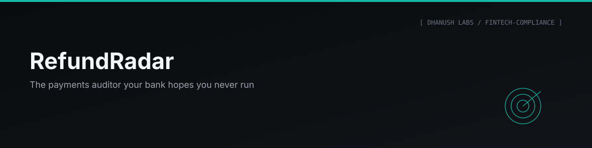
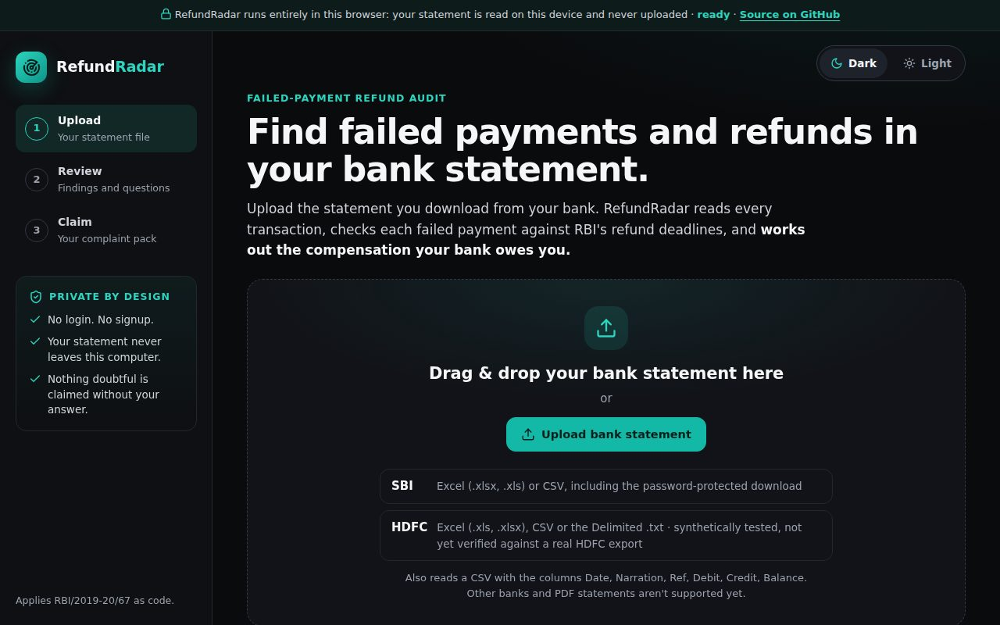
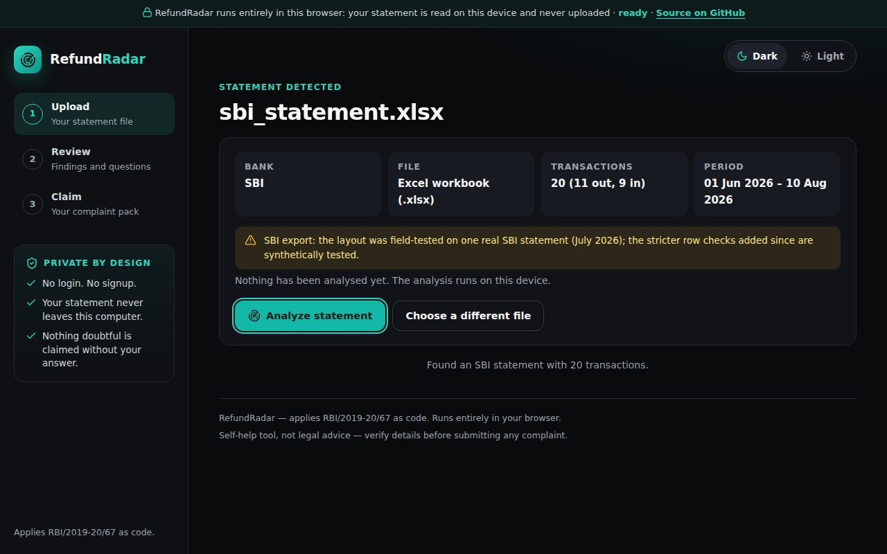
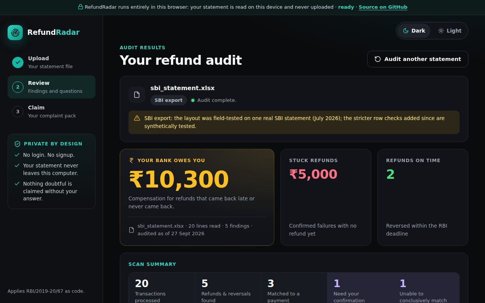
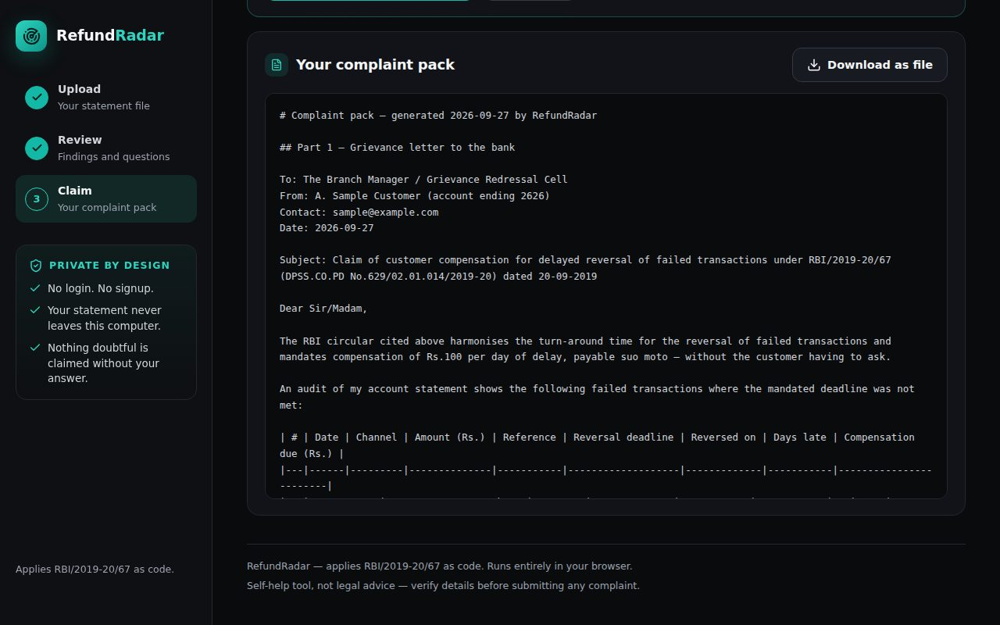

<p align="center"></p>


### The Payments Auditor Your Bank Hopes You Never Run

**[▶ Try the live demo →](https://dhanu2626.github.io/refundradar/)** — the RefundRadar app itself, running in your browser: upload your SBI or HDFC statement and it finds the failed payments, the late refunds and what your bank owes you. No install, no signup, nothing uploaded.

---

## Problem Statement

> [!IMPORTANT]
> When a digital payment fails in India — money debited, credit never arrives — [RBI circular RBI/2019-20/67](https://www.rbi.org.in/Scripts/NotificationUser.aspx?Id=11693) requires your bank to auto-reverse it within a fixed deadline and pay you ₹100 per day of delay, *suo moto*, without you complaining. In practice, almost nobody checks whether the bank complied. RefundRadar checks.

## Architecture

```
STATEMENT (.xlsx/.csv) ──parse──► RECONCILE debit ↔ reversal
                                        │
                                        ▼
                          APPLY RBI/2019-20/67 AS CODE
                                        │
                                        ▼
                       COMPLAINT PACK (letter + timeline + Ombudsman draft)
```

Everything runs locally — no server, no upload, statements never leave your machine.

## How It Works

```bash
python -m venv .venv
.venv\Scripts\python -m pip install -r requirements.txt
.venv\Scripts\python -m refundradar serve
```

Open `http://127.0.0.1:8626` → upload or drop an SBI statement (`.xlsx`, `.xls`, `.csv` or PDF; a password-protected download opens with its password) or an HDFC statement (`.xls`, `.xlsx`, `.csv`, the Delimited `.txt`, or PDF). RefundRadar first shows what it found in the file (bank, transactions, dates) and analyzes it when you say so. No statement to hand? "Try the sample statement" runs the same steps on synthetic data, and `samples/realistic/` holds synthetic statements laid out like SBI's and HDFC's own downloads, PDFs included. Or via CLI: `python -m refundradar audit mystatement.pdf` (`--password` for locked files, `--confirm <reference>` or `--confirm-row N` for a payment you know failed).

## Features

- **Reads SBI and HDFC statements** — Excel, CSV or PDF, including password-protected downloads. PDF reading is synthetically tested only (D18).
- **Reconciles every failed debit against its reversal** — flags late or missing refunds, ignores genuine merchant refunds.
- **Applies the circular as code** — computes exactly what's owed, clause by clause.
- **Generates the complaint pack** — grievance letter with evidence table, 30-day escalation timeline, pre-filled RBI Ombudsman draft.
- **Privacy by construction** — no name, DOB, phone, or login ever requested; `.gitignore` refuses real statement files by design.

## Screenshots

The live page with `samples/sbi_statement.xlsx`, a synthetic SBI export: upload, what was found in the file, the audit after two answers, and the letter.

| | |
|---|---|
|  |  |
|  |  |

## Interactive Demo

**[dhanu2626.github.io/refundradar](https://dhanu2626.github.io/refundradar/)** is the app you run locally, not a copy: the same page, and the same Python code (`refundradar/`) running in your browser on [Pyodide](https://pyodide.org), which the site serves itself. Upload your statement, check what was detected, analyze it, answer only the questions the rules require, and download the letter. The synthetic sample is a secondary link for trying it without a statement, and nothing in it is answered for you.

- **Nothing is uploaded.** Your file is read inside the page. There is no server behind it, and the page's Content-Security-Policy lets it connect only to its own site, so the browser itself refuses to send anything elsewhere.
- **The first visit downloads the Python runtime: 13.1 MB** (7 to 12 MB over the wire, depending on how much the host compresses), about 30 seconds on a 4 Mbps phone connection, with a live percentage while it arrives. The browser keeps it, so later visits start at once, and audits then run on your device.
- **Tested in Chromium, Firefox 156 and WebKit 2.52** (Safari's engine) at desktop width and at a 390px phone width: upload, detection, every kind of question, the letter, the download, locked files, PDFs, refusals. Real Safari on an iPhone or Mac hasn't been run; it needs iOS 16.4 or later.
- **SBI's password-protected download opens in the page.** The password is used once, on your device, and never stored; the code that decrypts (Pyodide's `cryptography`, about 2.4 MB) downloads only when you type one.
- **HDFC reading is synthetically tested**, not yet verified against a real HDFC export, and the page says so beside every HDFC result. SBI's layout was field-tested on one real statement; its strict row checks (D16) are synthetically tested.
- **PDF statements are read too**, SBI's and HDFC's, locked or not: the page rebuilds the bank's own table from the PDF and reads it with the same strict readers, running balance included (D18). The PDF reader (pdfminer.six, about 3 MB with what it needs) downloads only when you choose a PDF. It is **synthetically tested only**: no real SBI or HDFC PDF has been read yet, and the page says so beside every PDF result. Where a description wrapped onto a second line, a space can be lost ("SAMPLEFRIEND"); dates, amounts, balances and references are unaffected.
- **Other banks, and scanned or photographed statements, are refused by name**, not guessed at.
- **Run the demo locally:** `python tools/build_demo_page.py`, then `python -m http.server -d docs 8000` and open `http://localhost:8000` (it needs http, not a `file://` path).

## Engineering Decisions

Every judgment call is written down with reasoning and residual risk in `rules/DECISIONS.md`:

| Decision | Reasoning |
|---|---|
| Deadlines counted in calendar days | The circular defines T as a calendar date |
| NEFT excluded | Falls under a different regime (penal interest at repo + 2%) |
| Ambiguous UPI defaults to the longer deadline | Keeps the claim undisputable |
| Inferred reversals never auto-claimed | User confirms first, even when detectable from amount/timing |
| Payments with no reference are confirmed by their row | The statement prints nothing to confirm by; none is invented, and the letter says "not printed on statement" |
| SBI is read strictly, like HDFC | A row it can't read stops the audit and is named; the rows must reproduce SBI's balance, so none is silently dropped |
| The file is identified before it is analyzed | You see the bank, the transaction count and the dates first; a locked file's password is used once and kept nowhere |
| A narration's comma can't shift HDFC's columns | The Delimited download doesn't quote "NETBANK, MUM"; the surplus fields are joined back into the narration, and the balance must still add up |
| A PDF is read by rebuilding the bank's table | Then the same strict readers; a line that belongs to no transaction, or a row not read from its date down, stops the audit instead of being placed; scans are refused |

> [!WARNING]
> This is a self-help tool applying published RBI circulars to your own statement. It is **not legal advice** — verify every figure before submitting a complaint.

## Project Structure

```
refundradar/
├── refundradar/           parsing, reconciliation, RBI rule engine, complaint generator, web app
├── docs/                  the live page: the same app, run in the browser on Pyodide
├── samples/               synthetic statements; realistic/ is laid out like SBI's and HDFC's downloads (PDFs too),
│                          pdf_layouts/ draws them the ways other report writers draw a table
├── tools/                 builders for docs/ and the samples
├── rules/DECISIONS.md     every judgment call, written down
├── tests/                 331 tests incl. planted-ground-truth reconciliation exam
└── CONTRIBUTING.md        how to add a bank parser
```

## Tech Stack

Python · FastAPI (local web app) · openpyxl, xlrd, olefile (spreadsheets) · pdfminer.six (PDFs) · msoffcrypto-tool (password-protected files) · Pyodide (the live page) · pytest · Playwright and Selenium (browser tests)

## Results

| Statement format | Status |
|---|---|
| SBI Excel/CSV (incl. password-protected; web app, live demo and CLI) | ✅ layout field-tested on a real statement; strict row checks (D16) synthetic-tested |
| HDFC Excel / Delimited export (web app, live demo and CLI) | 🧪 synthetic-tested against its published layouts — awaiting a real-statement field test |
| Generic CSV | ✅ |
| Other banks | ❌ not read yet — refused by name, never guessed at |
| SBI and HDFC PDF statements (incl. password-protected; web app, live demo and CLI) | 🧪 synthetic-tested on the banks' layouts as known and 13 other drawings of them — no real bank PDF read yet |
| Scanned or photographed statements | ❌ refused: reading amounts off a picture could misread one |

331 tests passing, including a planted-ground-truth exam the reconciler must pass (find every failure, fall for no traps), plus a live field test on a real SBI statement.

## Future Improvements

A real SBI and HDFC PDF to verify the PDF reader against, more bank formats, per-bank grievance-cell addresses (v1.0 roadmap in `PROJECT.md`), and the RBI Account Aggregator consent-based "connect your bank" flow documented as the v2 ambition in `UX-SPEC.md`.

## Lessons Learned

Data minimization turned out to be a product strategy, not just a constraint — an app that never asks for identity data can't leak it. The canonical schema was built so an Account Aggregator feed would plug in as just another parser, not a rewrite.

## License

MIT © 2026 Dhanush Jangadi

## Contact

Dhanush Jangadi — [GitHub](https://github.com/Dhanu2626) · [LinkedIn](https://www.linkedin.com/in/jangadidhanush)

---
<p align="center"><sub>Part of the <b>Dhanush Labs</b> portfolio · engineered by <a href="https://github.com/Dhanu2626">Dhanush Jangadi</a></sub></p>
